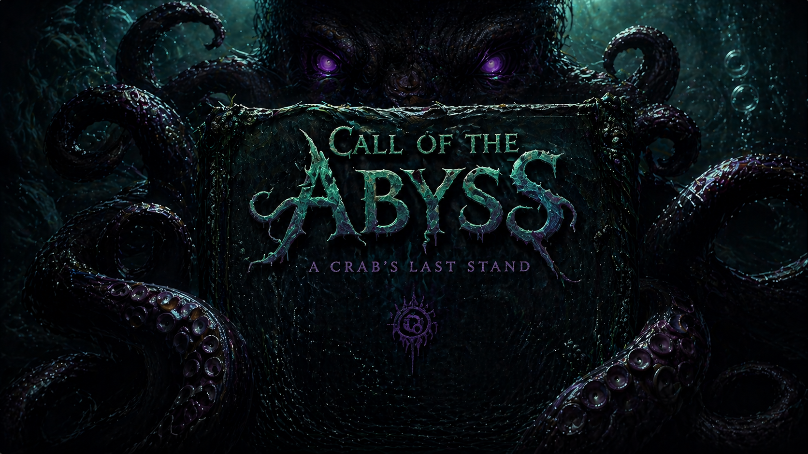

# Call of the Abyss 🦀

> **Hold the beach. The deep is rising.**

A browser-based wave-defense shooter built with Three.js. You play as a lone crab armed against an endless tide of deep-sea horrors — turtles, octopuses, and the ancient horror of Cthulhu himself. Survive as many waves as you can and carve your name into the global leaderboard.

🎮 **[Play free in your browser →](https://wavedash.com/games/call-of-the-abyss)**



---

## Features

- **Wave-defense gameplay** — increasingly brutal waves with scaling enemy stats
- **Three weapon tiers** — Pistol, Shotgun, and Charger (water gun mechanics; reload in the ocean)
- **Sand Burst ability** — a procedural WebGL ripple shader that knocks enemies back
- **Boss battles** — a massive boss starting wave 3 with a 3× speed dash mechanic
- **Elite enemies** — random elite spawns with boosted health, speed, and loot drops
- **Burrow base defense** — protect your burrow and spend coins to spawn friendly minion crabs
- **Positional 3D audio** — HRTF spatialized dialogue per enemy using the Web Audio API
- **Fully procedural ambient audio** — ocean waves, wind, crab scuttle sounds — zero audio files for ambience
- **No install** — runs entirely in the browser

---

## Tech Stack

| Layer | Technology |
|---|---|
| 3D Engine | [Three.js](https://threejs.org/) r170 |
| Build Tool | [Vite](https://vitejs.dev/) 6 |
| Audio | Web Audio API (procedural + MP3) |
| Language | Vanilla ES6 modules |

---

## Getting Started

### Prerequisites
- Node.js 18+
- npm

### Install & run locally

```bash
git clone https://github.com/YOUR_USERNAME/call-of-the-abyss.git
cd call-of-the-abyss
npm install
npm run dev
```

Open `http://localhost:3000` in your browser.

### Build for production

```bash
npm run build
```

Output goes to `dist/`. All asset paths are relative so the build deploys on any static host.

---

## Project Structure

```
├── src/
│   ├── main.js              # Entry point, game loop, UI events
│   ├── Engine.js            # Three.js scene, renderer, lighting
│   ├── World.js             # Beach geometry, shaders, environment
│   ├── Crab.js              # Player controller, animations, health
│   ├── Camera.js            # Third-person orbital camera
│   ├── Enemies.js           # Wave manager, enemy AI, boss logic
│   ├── Burrow.js            # Base defense, minion spawning
│   ├── Weapons.js           # Weapon system, projectile pooling
│   ├── Projectile.js        # Projectile pool
│   ├── EnemyProjectiles.js  # Enemy projectile pool (poison blobs)
│   ├── UpgradeSystem.js     # Wave-end upgrade modal
│   ├── AudioManager.js      # Web Audio API, procedural synthesis
│   ├── DialogueManager.js   # Floating speech bubbles + 3D positional audio
│   └── InputManager.js      # Keyboard/mouse input
├── public/
│   ├── models/              # 3D .glb models
│   │   └── dialogues/       # Voice line .mp3 files
│   ├── sounds/              # Combat/ambient sound effects
│   ├── images/              # UI images
│   └── textures/            # Game textures
├── index.html               # Main HTML + inline CSS UI
├── vite.config.js
└── package.json
```

---

## Third-Party Assets & Licenses

> ⚠️ The MIT license in this repo covers **source code only**. Third-party assets retain their original licenses as listed below.

### 3D Models

| File | Model | Author | License |
|------|-------|--------|---------|
| `sweet_crab_sketchfabweekly.glb` | Sweet Crab | Sketchfab Weekly | [CC BY 4.0](https://creativecommons.org/licenses/by/4.0/) |
| `animated_crab.glb` | Animated Crab | Sketchfab | [CC BY 4.0](https://creativecommons.org/licenses/by/4.0/) |
| `dave_the_octopus_rig_animation.glb` | Dave The Octopus (Rig Animation) | Guilherme Navarro | [CC BY 4.0](https://creativecommons.org/licenses/by/4.0/) |
| `stylized_turtle.glb` | Stylized Turtle | Sketchfab | [CC BY 4.0](https://creativecommons.org/licenses/by/4.0/) |
| `zombie_monster_slasher_necromorph.glb` | Zombie Monster Slasher Necromorph | Sketchfab | [CC BY 4.0](https://creativecommons.org/licenses/by/4.0/) |
| `boss_octopus.glb` | Derived from Dave The Octopus | Guilherme Navarro | [CC BY 4.0](https://creativecommons.org/licenses/by/4.0/) |
| `simple_rock_iv.glb` | Simple Rock IV | Sketchfab | [CC0 1.0 Public Domain](https://creativecommons.org/publicdomain/zero/1.0/) |
| `coconut_tree.glb` | Coconut Tree | Sketchfab | [CC0 1.0 Public Domain](https://creativecommons.org/publicdomain/zero/1.0/) |
| `fern_grass_02.glb` | Fern Grass | Sketchfab | [CC0 1.0 Public Domain](https://creativecommons.org/publicdomain/zero/1.0/) |

> 📝 Please verify author names and model URLs on Sketchfab and update this table accordingly.

### Audio

| File | Description | Author / Source | License |
|------|-------------|-----------------|---------|
| `sounds/alec_koff-epic-drums-tribal.ogg` | Tribal drum ambience | Alec Koff | [CC BY 4.0](https://creativecommons.org/licenses/by/4.0/) — attribution required |
| `sounds/pistol.mp3` | Pistol SFX | — | [CC0 1.0 Public Domain](https://creativecommons.org/publicdomain/zero/1.0/) |
| `sounds/shotgun.mp3` | Shotgun SFX | — | [CC0 1.0 Public Domain](https://creativecommons.org/publicdomain/zero/1.0/) |
| `sounds/smg.mp3` | SMG SFX | — | [CC0 1.0 Public Domain](https://creativecommons.org/publicdomain/zero/1.0/) |
| `sounds/heavy.mp3` | Heavy weapon SFX | — | [CC0 1.0 Public Domain](https://creativecommons.org/publicdomain/zero/1.0/) |
| `sounds/hit.mp3` | Hit SFX | — | [CC0 1.0 Public Domain](https://creativecommons.org/publicdomain/zero/1.0/) |
| `sounds/reload.wav` | Reload SFX | — | [CC0 1.0 Public Domain](https://creativecommons.org/publicdomain/zero/1.0/) |
| `sounds/turtle_*.mp3` | Turtle enemy SFX | — | [CC0 1.0 Public Domain](https://creativecommons.org/publicdomain/zero/1.0/) |
| `sounds/boss_*.mp3` | Boss enemy SFX | — | [CC0 1.0 Public Domain](https://creativecommons.org/publicdomain/zero/1.0/) |
| `models/dialogues/*.mp3` | Character voice lines | Original / AI-generated | Original work |

### Fonts

| Font | Source | License |
|------|--------|---------|
| Outfit | [Google Fonts](https://fonts.google.com/specimen/Outfit) | [OFL 1.1](https://scripts.sil.org/OFL) |
| Cinzel | [Google Fonts](https://fonts.google.com/specimen/Cinzel) | [OFL 1.1](https://scripts.sil.org/OFL) |

### Code Dependencies

| Package | License |
|---------|---------|
| [three](https://github.com/mrdoob/three.js) | MIT |
| [vite](https://github.com/vitejs/vite) | MIT |

---

## Contributing

PRs are welcome. Please open an issue first for major changes.

---

## License

**Source code** — [MIT](./LICENSE) © 2025 Aswin Vinod

**Third-party assets** — see the [Third-Party Assets](#third-party-assets--licenses) section above. Each asset retains its original license and must be attributed accordingly.
